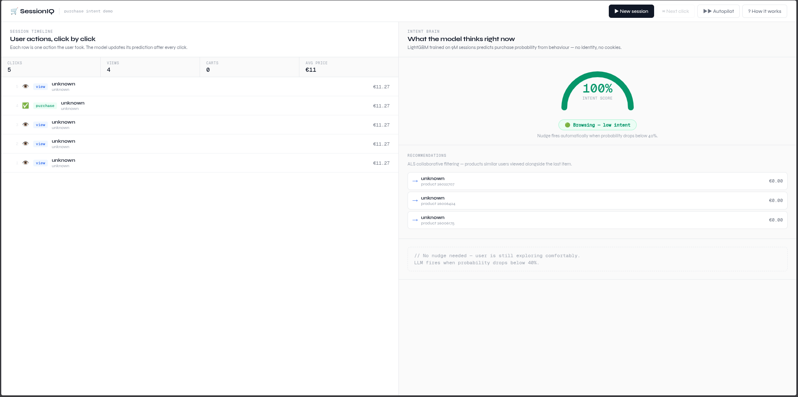

# 🛒 SessionIQ

> *What if you could tell — mid-session, click by click — whether a user was about to buy or leave?*

SessionIQ is an end-to-end ML system for e-commerce session intelligence. It predicts purchase intent in real time as a user browses, generates collaborative filtering recommendations, and triggers an LLM-powered recovery message the moment abandonment risk is detected — all running locally, no external APIs required.

Built by **[Nicolás Aller Ponte](https://github.com/nicolasallerponte)** on a real dataset of 13 million e-commerce events (REES46, 2019).

---

## Demo



Click-by-click simulation of a real shopping session. The gauge updates after every action. When the model detects the user is about to leave, llama3.2 fires a personalised recovery message.

---

## Architecture

```
Raw events (CSV, 13M rows)
        │
        ▼
┌─────────────────────┐
│   Data Pipeline     │  Polars + DuckDB out-of-core processing
│   features.py       │  Temporal split: Oct train / Nov test
└────────┬────────────┘
         │  session features
         ▼
┌─────────────────────┐
│  Intent Classifier  │  LightGBM + CalibratedClassifierCV
│  intent.py          │  ROC-AUC 0.86 · PR-AUC 0.73
└────────┬────────────┘
         │  purchase probability
         ├──────────────────────────────────┐
         ▼                                  ▼
┌─────────────────────┐        ┌────────────────────────┐
│  ALS Recommender    │        │  LLM Nudge Engine      │
│  two_tower.py       │        │  prompt_builder.py     │
│  implicit library   │        │  llama3.2 via Ollama   │
└─────────────────────┘        └────────────────────────┘
         │                                  │
         └──────────────┬───────────────────┘
                        ▼
              ┌──────────────────┐
              │  Flask Demo App  │
              │  app.py          │
              └──────────────────┘
```

## Key Design Decisions

**Temporal split (not random)** — October 2019 trains, November 2019 tests. Random splits leak future information into training, making metrics look better than reality. The temporal split mirrors production.

**Mid-session prediction** — the model sees only the first 5 events of each session. A system that waits for the whole session before predicting is useless in production. The challenge is reading intent from partial signals.

**Calibrated probabilities** — raw LightGBM scores are not probabilities. `CalibratedClassifierCV` with isotonic regression turns the output into something meaningful: 72% really means 72% chance of purchase.

**DuckDB for out-of-core processing** — November CSV is 8.4 GB on an 11 GB RAM machine. Instead of loading it into memory, DuckDB runs SQL directly on the file with spill-to-disk via `SET temp_directory`.

**ALS over neural recommender** — trains in ~10 minutes on CPU across 166k products and 9.2M sessions. Fast enough to iterate, good enough for a demo. Weighted matrix: view=1, cart=3, purchase=5.

**Three-level urgency** — `explore` (p≥0.40), `nudge` (0.20≤p<0.40), `rescue` (p<0.20). The LLM prompt, tone, and discount offer change at each level. A single threshold misses nuance.

**Local LLM with fallback** — llama3.2 via Ollama runs entirely on-device. No API cost, no network latency. Rule-based fallback templates kick in if Ollama is unavailable.

---

## Results

| Metric | Value |
|---|---|
| ROC-AUC | 0.861 |
| PR-AUC | 0.729 |
| F1 (purchase class) | 0.80 |
| Optimal threshold | 0.66 |
| Train sessions | 9.2M |
| Test sessions | 11.7M |
| Products | 166,794 |

SHAP top features: `n_events_observed`, `session_duration_seconds`, `n_carts`, `cart_view_ratio`.

---

## Quickstart

**Requirements:** Python 3.11, [uv](https://docs.astral.sh/uv/), [Ollama](https://ollama.com)

```bash
# Clone and install
git clone https://github.com/nicolasallerponte/sessioniq.git
cd sessioniq
uv sync

# Download dataset (Kaggle credentials required)
# Place 2019-Oct.csv and 2019-Nov.csv in data/raw/

# Build features and train models
uv run python -m sessioniq.pipeline.features
uv run python -m sessioniq.models.intent
uv run python -m sessioniq.models.evaluation
uv run python -m sessioniq.recommender.two_tower

# Prepare demo data
uv run python scripts/prepare_demo_data.py

# Pull LLM
ollama pull llama3.2

# Run demo
uv run python src/sessioniq/app/app.py
# → http://localhost:5050
```

---

## Project Structure

```
sessioniq/
├── src/sessioniq/
│   ├── pipeline/
│   │   ├── loader.py          # Polars lazy loader, temporal split
│   │   └── features.py        # Session feature engineering, DuckDB out-of-core
│   ├── models/
│   │   ├── intent.py          # LightGBM + calibration
│   │   ├── tuning.py          # Optuna TPE, 30 trials
│   │   └── evaluation.py      # SHAP, PR curve, threshold search
│   ├── recommender/
│   │   └── two_tower.py       # ALS collaborative filtering
│   ├── llm/
│   │   ├── prompt_builder.py  # Dynamic prompt, structured JSON output
│   │   └── fallback.py        # Rule-based fallback
│   └── app/
│       ├── app.py             # Flask demo with autopilot mode
│       └── demo.png           # Screenshot
├── scripts/
│   └── prepare_demo_data.py   # DuckDB-powered demo data extraction
└── tests/
    └── unit/
        └── test_features.py
```

---

## Dataset

[REES46 eCommerce Behavior Data](https://www.kaggle.com/datasets/mkechinov/ecommerce-behavior-data-from-multi-category-store) — multi-category store, October and November 2019.

Events: `view`, `cart`, `remove_from_cart`, `purchase`.

---

## Tech Stack

`polars` · `duckdb` · `lightgbm` · `scikit-learn` · `optuna` · `shap` · `implicit` · `flask` · `ollama` · `uv` · `ruff`

---

## License

MIT — see [LICENSE](LICENSE).
