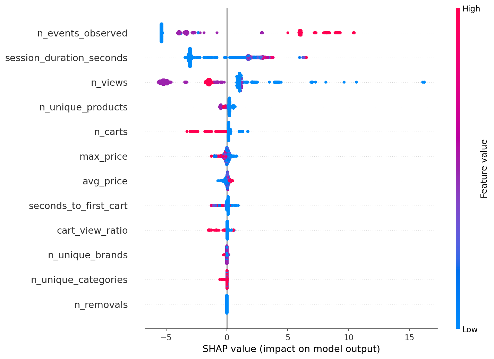
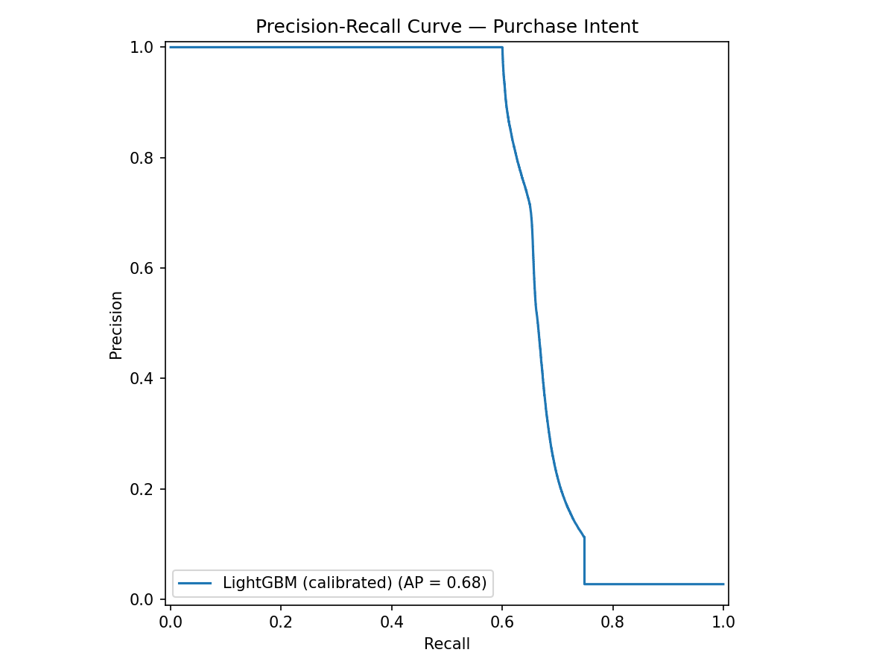
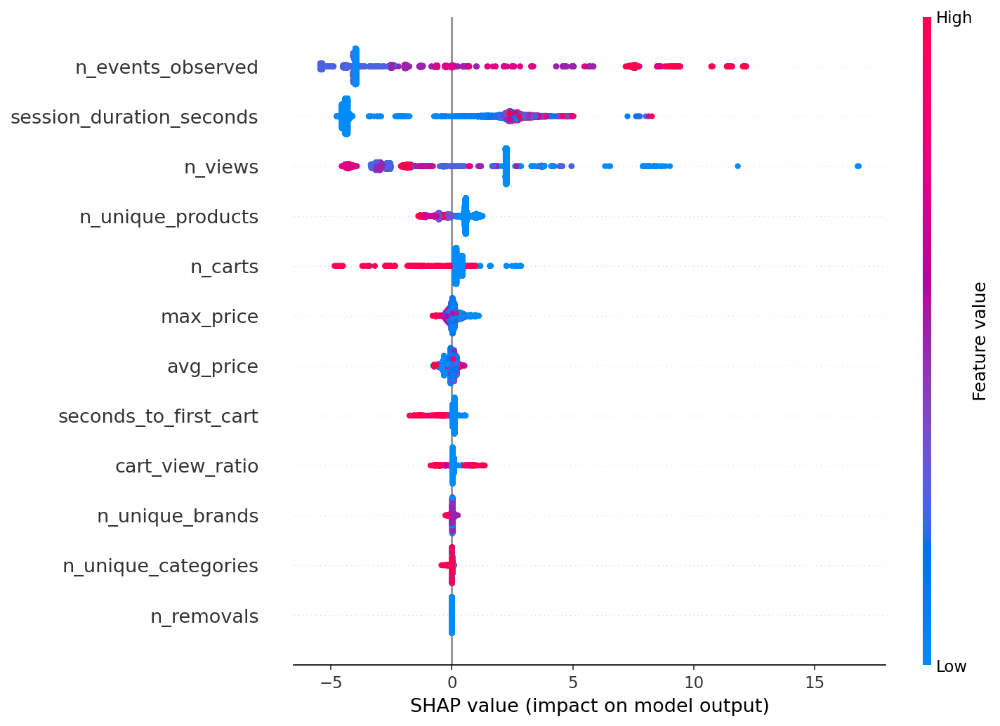
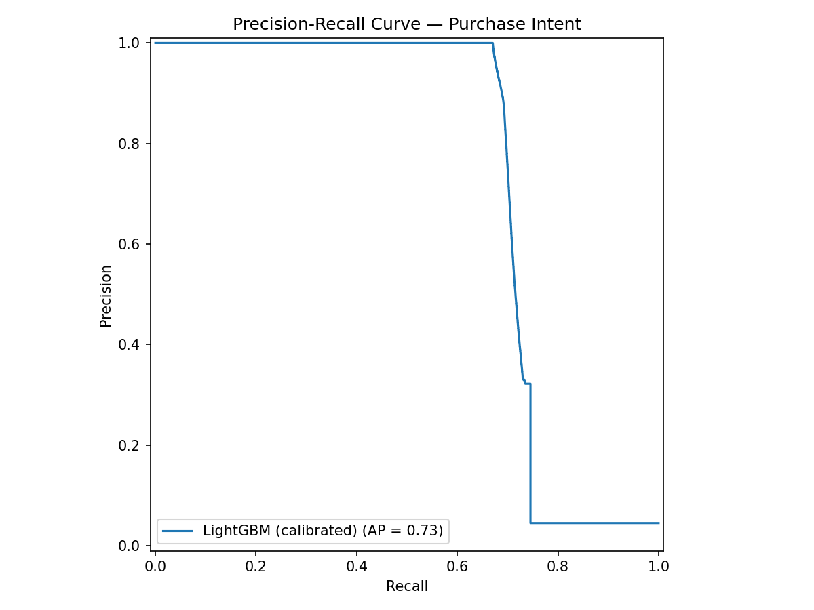

# sessioniq

> End-to-end ML system for e-commerce session analysis: sequential purchase intent prediction, collaborative filtering recommendations, and LLM-powered real-time nudges.


## Overview

sessioniq predicts whether a user will purchase during their current session — using only their first 5 clicks. When abandonment risk is high, it surfaces relevant product recommendations and generates a personalised nudge via LLM.

The system is trained on the [REES46 eCommerce dataset](https://www.kaggle.com/datasets/mkechinov/ecommerce-behavior-data-from-multi-category-store) (67M+ events, Oct–Nov 2019) and follows a strict **temporal train/test split**: October for training, November for evaluation.

```
Raw clickstream (67M events)
        │
        ▼
  Feature Engineering          ← Polars lazy eval + DuckDB out-of-core
  (first 5 events/session)
        │
        ▼
  Intent Classifier             ← Calibrated LightGBM
  P(purchase | session[:5])     ROC-AUC 0.861 · PR-AUC 0.729
        │
        ├──── low intent ──────▶ Recommender  ← ALS (implicit) + FAISS
        │                        top-5 similar products
        │
        └──────────────────────▶ LLM Nudge    ← Gemini 1.5 Pro
                                  structured JSON output
                                  3-level urgency logic
```

## Architecture & Design Decisions

### Why temporal split instead of random?

A random train/test split would leak future behaviour patterns into training. October → November mirrors real production: the model never sees data from the period it's evaluated on.

### Why first 5 events only?

Predicting intent at the end of a session (when you already know the outcome) is trivial and useless in production. sessioniq predicts at click 5 — early enough to intervene, hard enough to be meaningful.

### Why DuckDB for November?

The November CSV is 8.4 GB / 67M rows. Polars would OOM on an 11 GB machine. DuckDB processes it out-of-core via a two-pass SQL query (features first, labels second), never loading the full file into RAM.

### Why calibrated probabilities?

Raw LightGBM scores are not probabilities — a score of 0.7 doesn't mean 70% chance of purchase. `CalibratedClassifierCV` with isotonic regression maps scores to real probabilities, making the intent gauge in the demo meaningful.

### Why ALS over a pure two-tower?

ALS on a weighted session×product matrix (view=1, cart=3, purchase=5) trains in ~10 min on CPU with 166k products and 9.2M sessions. A neural two-tower would require a GPU and 10× more engineering for marginal gains on this dataset. ALS embeddings are the backbone; FAISS provides sub-millisecond ANN retrieval at inference.

## Results

| Metric            | Value   |
| ----------------- | ------- |
| ROC-AUC           | 0.861   |
| PR-AUC            | 0.729   |
| F1 (purchase)     | 0.80    |
| Optimal threshold | 0.66    |
| Train sessions    | 9.2M    |
| Test sessions     | 11.7M   |
| Products indexed  | 166,794 |

Evaluated on November 2019 holdout (4.5% conversion rate).

### SHAP Feature Importance



`n_events_observed` and `session_duration_seconds` are the strongest signals — users who explore more and stay longer are more likely to purchase. `n_carts` has high impact when non-zero but is sparse with only 5 events. `n_removals` and `n_unique_categories` contribute minimally and are candidates for removal in a leaner version.

### Precision-Recall Curve



The steep drop after recall ~0.67 reflects the fundamental difficulty of the problem: predicting purchase intent from 5 clicks on a dataset with 4.5% conversion. A random classifier would achieve AP=0.045.

## Project Structure

```
sessioniq/
├── src/sessioniq/
│   ├── pipeline/
│   │   ├── loader.py          # Polars lazy loader, temporal split
│   │   └── features.py        # Session feature engineering + DuckDB
│   ├── models/
│   │   ├── intent.py          # Calibrated LightGBM training
│   │   ├── tuning.py          # Optuna HPO, 30 trials, temporal CV
│   │   └── evaluation.py      # Threshold search, SHAP, PR curve
│   ├── recommender/
│   │   └── two_tower.py       # ALS + FAISS product retrieval
│   └── llm/
│       ├── prompt_builder.py  # Dynamic prompt with session context
│       └── fallback.py        # Rule-based fallback if API fails
├── data/
│   ├── raw/                   # CSVs (gitignored)
│   └── processed/             # Parquet features (gitignored)
├── models/
│   └── eval/                  # PR curve, SHAP plots
└── pyproject.toml             # uv + hatchling + ruff
```

## Quickstart

### Prerequisites

- Python 3.11+
- [uv](https://docs.astral.sh/uv/)
- Kaggle API token
- Gemini API key

### Setup

```bash
git clone https://github.com/nicolasallerponte/sessioniq.git
cd sessioniq
uv sync --all-groups
uv run pre-commit install
```

### Data

```bash
export KAGGLE_USERNAME=your_username
export KAGGLE_KEY=your_key
uv run kaggle datasets download \
  -d mkechinov/ecommerce-behavior-data-from-multi-category-store \
  -p data/raw/ --unzip
```

### Train

```bash
# 1. Feature engineering
uv run python src/sessioniq/pipeline/features.py

# 2. Hyperparameter tuning (~25 min)
uv run python src/sessioniq/models/tuning.py

# 3. Train intent classifier (~20 min)
uv run python src/sessioniq/models/intent.py

# 4. Evaluation + plots
uv run python src/sessioniq/models/evaluation.py

# 5. Train recommender (~10 min)
uv run python src/sessioniq/recommender/two_tower.py
```

### Environment

```bash
cp .env.example .env
# Fill in GEMINI_API_KEY
```

## Stack

| Layer           | Technology                     |
| --------------- | ------------------------------ | ----------- |
| Data processing | Polars, DuckDB                 |
| ML              | LightGBM, scikit-learn, Optuna |
| Explainability  | SHAP                           |
| Recommender     | implicit (ALS), FAISS          |
| LLM             | Gemini 1.5 Pro                 | # sessioniq |

> End-to-end ML system for e-commerce session analysis: sequential purchase intent prediction, collaborative filtering recommendations, and LLM-powered real-time nudges.


## Overview

sessioniq predicts whether a user will purchase during their current session — using only their first 5 clicks. When abandonment risk is high, it surfaces relevant product recommendations and generates a personalised nudge via LLM.

The system is trained on the [REES46 eCommerce dataset](https://www.kaggle.com/datasets/mkechinov/ecommerce-behavior-data-from-multi-category-store) (67M+ events, Oct–Nov 2019) and follows a strict **temporal train/test split**: October for training, November for evaluation.

```
Raw clickstream (67M events)
        │
        ▼
  Feature Engineering          ← Polars lazy eval + DuckDB out-of-core
  (first 5 events/session)
        │
        ▼
  Intent Classifier             ← Calibrated LightGBM
  P(purchase | session[:5])     ROC-AUC 0.861 · PR-AUC 0.729
        │
        ├──── low intent ──────▶ Recommender  ← ALS (implicit) + FAISS
        │                        top-5 similar products
        │
        └──────────────────────▶ LLM Nudge    ← Gemini 1.5 Pro
                                  structured JSON output
                                  3-level urgency logic
```

## Architecture & Design Decisions

### Why temporal split instead of random?

A random train/test split would leak future behaviour patterns into training. October → November mirrors real production: the model never sees data from the period it's evaluated on.

### Why first 5 events only?

Predicting intent at the end of a session (when you already know the outcome) is trivial and useless in production. sessioniq predicts at click 5 — early enough to intervene, hard enough to be meaningful.

### Why DuckDB for November?

The November CSV is 8.4 GB / 67M rows. Polars would OOM on an 11 GB machine. DuckDB processes it out-of-core via a two-pass SQL query (features first, labels second), never loading the full file into RAM.

### Why calibrated probabilities?

Raw LightGBM scores are not probabilities — a score of 0.7 doesn't mean 70% chance of purchase. `CalibratedClassifierCV` with isotonic regression maps scores to real probabilities, making the intent gauge in the demo meaningful.

### Why ALS over a pure two-tower?

ALS on a weighted session×product matrix (view=1, cart=3, purchase=5) trains in ~10 min on CPU with 166k products and 9.2M sessions. A neural two-tower would require a GPU and 10× more engineering for marginal gains on this dataset. ALS embeddings are the backbone; FAISS provides sub-millisecond ANN retrieval at inference.

## Results

| Metric            | Value   |
| ----------------- | ------- |
| ROC-AUC           | 0.861   |
| PR-AUC            | 0.729   |
| F1 (purchase)     | 0.80    |
| Optimal threshold | 0.66    |
| Train sessions    | 9.2M    |
| Test sessions     | 11.7M   |
| Products indexed  | 166,794 |

Evaluated on November 2019 holdout (4.5% conversion rate).

### SHAP Feature Importance



`n_events_observed` and `session_duration_seconds` are the strongest signals — users who explore more and stay longer are more likely to purchase. `n_carts` has high impact when non-zero but is sparse with only 5 events. `n_removals` and `n_unique_categories` contribute minimally and are candidates for removal in a leaner version.

### Precision-Recall Curve



The steep drop after recall ~0.67 reflects the fundamental difficulty of the problem: predicting purchase intent from 5 clicks on a dataset with 4.5% conversion. A random classifier would achieve AP=0.045.

## Project Structure

```
sessioniq/
├── src/sessioniq/
│   ├── pipeline/
│   │   ├── loader.py          # Polars lazy loader, temporal split
│   │   └── features.py        # Session feature engineering + DuckDB
│   ├── models/
│   │   ├── intent.py          # Calibrated LightGBM training
│   │   ├── tuning.py          # Optuna HPO, 30 trials, temporal CV
│   │   └── evaluation.py      # Threshold search, SHAP, PR curve
│   ├── recommender/
│   │   └── two_tower.py       # ALS + FAISS product retrieval
│   └── llm/
│       ├── prompt_builder.py  # Dynamic prompt with session context
│       └── fallback.py        # Rule-based fallback if API fails
├── data/
│   ├── raw/                   # CSVs (gitignored)
│   └── processed/             # Parquet features (gitignored)
├── models/
│   └── eval/                  # PR curve, SHAP plots
└── pyproject.toml             # uv + hatchling + ruff
```

## Quickstart

### Prerequisites

- Python 3.11+
- [uv](https://docs.astral.sh/uv/)
- Kaggle API token
- Gemini API key

### Setup

```bash
git clone https://github.com/nicolasallerponte/sessioniq.git
cd sessioniq
uv sync --all-groups
uv run pre-commit install
```

### Data

```bash
export KAGGLE_USERNAME=your_username
export KAGGLE_KEY=your_key
uv run kaggle datasets download \
  -d mkechinov/ecommerce-behavior-data-from-multi-category-store \
  -p data/raw/ --unzip
```

### Train

```bash
# 1. Feature engineering
uv run python src/sessioniq/pipeline/features.py

# 2. Hyperparameter tuning (~25 min)
uv run python src/sessioniq/models/tuning.py

# 3. Train intent classifier (~20 min)
uv run python src/sessioniq/models/intent.py

# 4. Evaluation + plots
uv run python src/sessioniq/models/evaluation.py

# 5. Train recommender (~10 min)
uv run python src/sessioniq/recommender/two_tower.py
```

### Environment

```bash
cp .env.example .env
# Fill in GEMINI_API_KEY
```

## Stack

| Layer           | Technology                     |
| --------------- | ------------------------------ |
| Data processing | Polars, DuckDB                 |
| ML              | LightGBM, scikit-learn, Optuna |
| Explainability  | SHAP                           |
| Recommender     | implicit (ALS), FAISS          |
| LLM             | Gemini 1.5 Pro                 |
| App             | Streamlit, Plotly              |
| Packaging       | uv, hatchling                  |
| Linting         | ruff                           |
| CI              | GitHub Actions                 |

## Contributing

See [CONTRIBUTING.md](CONTRIBUTING.md).

## License

MIT
| App | Streamlit, Plotly |
| Packaging | uv, hatchling |
| Linting | ruff |
| CI | GitHub Actions |

## Contributing

See [CONTRIBUTING.md](CONTRIBUTING.md).

## License

MIT
